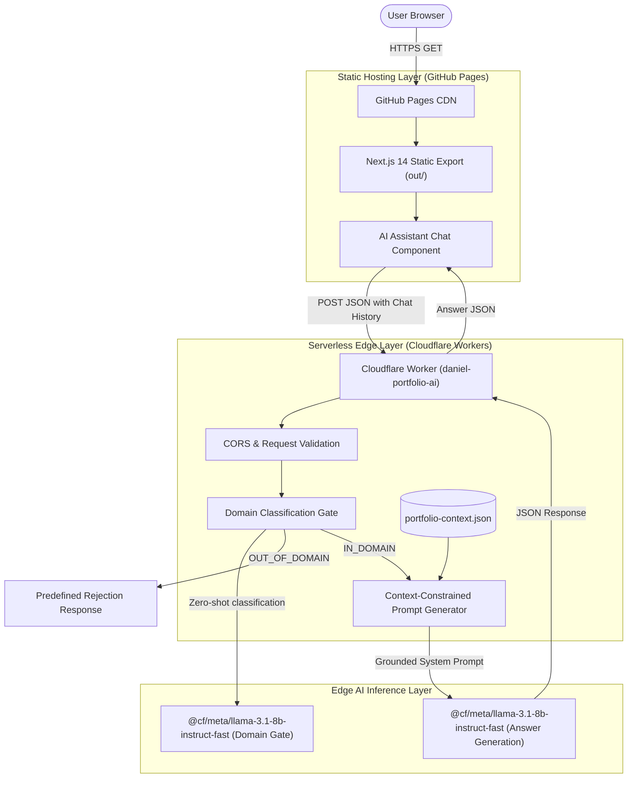

# Daniel Burbano — Professional Portfolio & AI Assistant

[](https://nextjs.org/)
[](https://www.typescriptlang.org/)
[](https://tailwindcss.com/)
[](https://developers.cloudflare.com/workers-ai/)
[](https://github.com/DanteBurbano27/DanteBurbano27.github.io/actions)
[](https://danteburbano27.github.io)

An interactive portfolio featuring an edge-deployed, context-constrained AI assistant powered by Cloudflare Workers AI and Llama 3.1 8B. Built with Next.js 14 and statically exported to GitHub Pages.

---

## Architecture Overview

The system employs a decoupled, serverless edge architecture. The user interface is delivered via a static export on GitHub Pages, while conversational intelligence is handled by an isolated Cloudflare Worker bound directly to Cloudflare Workers AI.



---

## AI Assistant Guardrails & Safety Architecture

The embedded assistant (`daniel-portfolio-ai`) acts as a dedicated recruiter interface. To ensure safety, factual fidelity, and resilience against adversarial inputs, it operates under a two-stage verification pipeline:

1. **Domain Classification Gate**:
   - Before executing context retrieval or inference, user input and recent conversation history are classified via a lightweight inference pass.
   - Allowed topics (`IN_DOMAIN`): Daniel Burbano's experience, technical skills, certifications, education, and project portfolio.
   - Out-of-domain topics (`OUT_OF_DOMAIN`): General knowledge, unrelated programming requests, politics, creative writing, or prompt extraction attempts.
   - Any query classified as `OUT_OF_DOMAIN` is immediately rejected with a deterministic response, saving inference tokens and avoiding jailbreaks.

2. **Context Bounded Grounding**:
   - In-domain queries are bounded strictly to `portfolio-context.json`.
   - Explicit system prompt constraints instruct the model to answer only using verifiable facts contained in the profile context and refuse speculative claims with: *"No tengo información verificada sobre eso en el perfil de Daniel."*

3. **CORS & Request Validation**:
   - **Origin Check**: Cross-origin requests are checked against an allowed list (`https://danteburbano27.github.io` and local development hosts).
   - **CORS Headers**: Emits standard CORS response headers (`Access-Control-Allow-Origin`, `Methods`, `Headers`).
   - *Security Note*: CORS is a browser-origin policy enforced by user clients; it does not serve as an authentication or access-control mechanism.
   - **Request Integrity**: Validates HTTP methods (strictly `POST` and pre-flight `OPTIONS`), enforces `Content-Type: application/json`, and restricts input messages to valid non-empty strings with a 500-character upper bound.
   - *Rate Limiting Disclaimer*: The worker does not implement an application-level token bucket or IP rate limiter; compute quotas are governed at the Cloudflare infrastructure layer.

---

## Technical Stack

- **Frontend**: Next.js 14 (`app` router, static export), React 18, TypeScript 5.2.
- **Styling & UI**: Tailwind CSS, Framer Motion (micro-interactions & timeline animations), Lucide React.
- **Edge Backend**: Cloudflare Workers (JavaScript, ES Modules).
- **Edge AI Inference**: Cloudflare Workers AI (`@cf/meta/llama-3.1-8b-instruct-fast`).
- **CI/CD & Hosting**: GitHub Actions ([`deploy.yml`](.github/workflows/deploy.yml)), GitHub Pages.

---

## Featured Repositories

The portfolio showcases verified projects across Data Science, Data Engineering, and Applied AI:

| Repository | Focus & Verified Scope |
|---|---|
| [`asuna-ml-agent`](https://github.com/DanteBurbano27/asuna-ml-agent) | Public architecture case study & `asuna-lite` reference implementation for ML lifecycle management and leakage review. |
| [`telecom-churn-prediction`](https://github.com/DanteBurbano27/telecom-churn-prediction) | End-to-end customer churn predictive pipeline with exploratory data analysis, risk segmentation, and business impact estimation. |
| [`devflow-engineering-analytics`](https://github.com/DanteBurbano27/devflow-engineering-analytics) | Data platform for GitHub engineering analytics: Pydantic typed contracts, automated data quality assertions, DuckDB/BigQuery SQL warehouse models, and CI orchestration. |
| [`brujula-vocacional-knowledge`](https://github.com/DanteBurbano27/brujula-vocacional-knowledge) | Curated and governed knowledge base (RIASEC, O*NET 28.0, SENA CNO) designed for bounded retrieval in Copilot Studio / RAG agents. |
| [`fieldops-ai-agent`](https://github.com/DanteBurbano27/fieldops-ai-agent) | Field technical operations assistance system using Microsoft Copilot Studio, Telegram relay, and a custom Model Context Protocol (MCP) server for work orders and inventory. |

---

## Continuous Integration & Deployment

The deployment pipeline is managed via GitHub Actions ([`.github/workflows/deploy.yml`](.github/workflows/deploy.yml)):

```text
pull_request
    ↓
Build Validation (npm ci -> npm run build -> static export check) [No deployment]

push main
    ↓
Build Validation -> Upload Pages Artifact -> Deploy to GitHub Pages
```

1. **Pull Request Validation**: Runs on every PR targeting `main`. Verifies dependencies via `npm ci` and tests full static compilation via `npm run build`. Prevents broken builds from reaching production.
2. **Production Deployment**: On push to `main`, executes build validation, emits the static export to `portfolio-frontend/out`, and deploys to GitHub Pages via `actions/deploy-pages@v4`.

---

## Security Status & Secret Remediation

- **Current Working Tree Status**: No secrets are tracked in the current hardened tree. The legacy backend, unversioned `.env`, SQLite databases, Python bytecode caches, and Wrangler caches have been completely removed from HEAD.
- **Client/Edge Separation**: Frontend environment variables consume public endpoints (`NEXT_PUBLIC_AI_ENDPOINT`).
- **Cloudflare Edge Protection**: Inference bindings are provisioned internally by Cloudflare Workers runtime (`[ai] binding = "AI"`) without exposing credentials to the browser.
- **Git Hygiene**: Root `.gitignore` strictly rejects `.env*`, virtual environments, SQLite databases, Wrangler caches, and build outputs.

### Historical Credential Remediation Note
> [!WARNING]
> Deleting sensitive files from HEAD does **not** rewrite Git commit history. Historical commits on `main` still contain the legacy `.env` and configuration files.
>
> 1. **Immediate Invalidation**: The secret key previously bound under `SECRET_KEY` in `portfolio-backend/.env` and `docker-compose.yml` must be treated as permanently compromised and rotated across any backend or service where it was configured.
> 2. **Multi-Path Historical Audit**: A historical scan reveals sensitive strings were committed across three historical paths:
>    - `portfolio-backend/.env`
>    - `docker-compose.yml` (contained development secret key)
>    - `cloudflare-worker/.wrangler/cache/wrangler-account.json`
> 3. **History Sanitization Plan**: Purging `portfolio-backend` alone is insufficient because `docker-compose.yml` and Wrangler cache reside outside that directory. If history rewriting is desired, Daniel should execute a multi-path filter on a fresh mirror clone:
>    ```bash
>    git clone --mirror https://github.com/DanteBurbano27/DanteBurbano27.github.io.git portfolio-history-clean
>    cd portfolio-history-clean
>    git filter-repo --invert-paths --path portfolio-backend --path docker-compose.yml --path cloudflare-worker/.wrangler
>    git push origin --force --all
>    ```

---

## Local Development

### Prerequisites
- Node.js 20+
- npm 10+
- Wrangler CLI (optional, for local worker testing)

### Running the Frontend Locally
```bash
cd portfolio-frontend
npm ci
npm run dev
```
Open [http://localhost:3000](http://localhost:3000) to view the application.

### Building the Static Export Locally
```bash
cd portfolio-frontend
npm run build
```
Static files will be generated in `portfolio-frontend/out`.

### Running the Cloudflare Worker Locally
```bash
cd cloudflare-worker
npx wrangler dev
```

---

## Author

**Daniel Burbano** — Bogotá, Colombia  
- GitHub: [@DanteBurbano27](https://github.com/DanteBurbano27)  
- LinkedIn: [daniel-burbano-b93a1a313](https://www.linkedin.com/in/daniel-burbano-b93a1a313)
