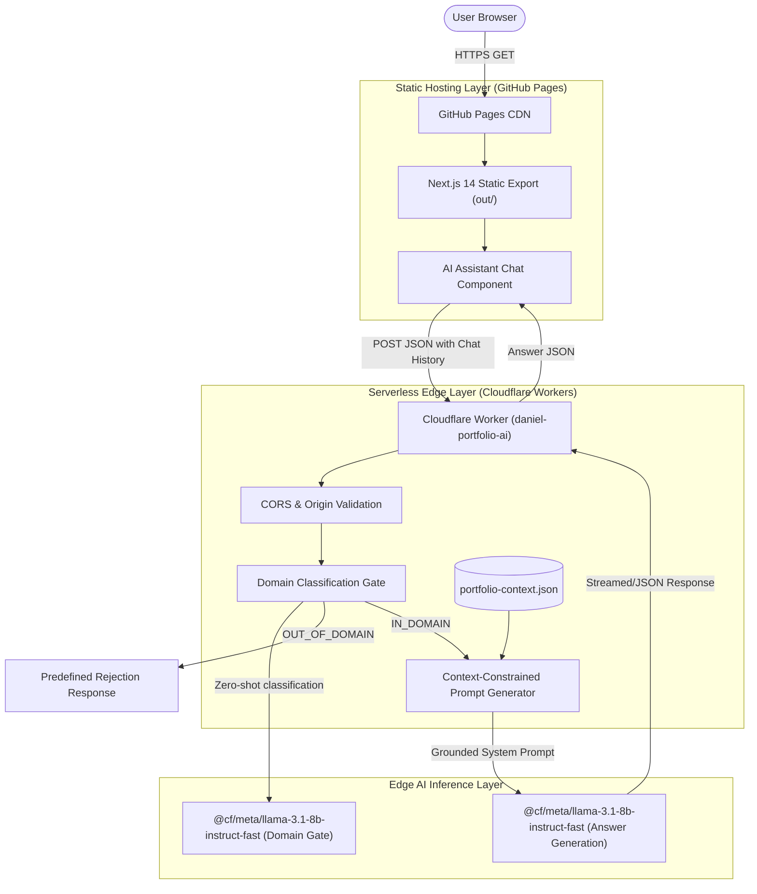

# Daniel Burbano — Professional Portfolio & AI Assistant

[](https://nextjs.org/)
[](https://www.typescriptlang.org/)
[](https://tailwindcss.com/)
[](https://developers.cloudflare.com/workers-ai/)
[](https://danteburbano27.github.io)

An interactive portfolio featuring an edge-deployed, context-constrained AI assistant powered by Cloudflare Workers AI and Llama 3.1 8B. Built with Next.js 14 and statically exported to GitHub Pages.

---

## Architecture Overview

The system employs a decoupled, serverless edge architecture. The user interface is delivered via a static export on GitHub Pages, while conversational intelligence is handled by an isolated Cloudflare Worker bound directly to Cloudflare Workers AI.



---

## AI Assistant Guardrails & Safety Architecture

The embedded assistant (`daniel-portfolio-ai`) acts as a dedicated recruiter interface. To ensure safety, factual fidelity, and resilience against adversarial inputs, it operates under a two-stage verification pipeline:

1. **Domain Classification Gate**:
   - Before executing context retrieval or inference, user input and recent conversation history are classified via a lightweight inference pass.
   - Allowed topics (`IN_DOMAIN`): Daniel Burbano's experience, technical skills, certifications, education, and project portfolio.
   - Out-of-domain topics (`OUT_OF_DOMAIN`): General knowledge, unrelated programming requests, politics, creative writing, or prompt extraction attempts.
   - Any query classified as `OUT_OF_DOMAIN` is immediately rejected with a deterministic response, saving inference tokens and avoiding jailbreaks.

2. **Context Bounded Grounding**:
   - In-domain queries are bounded strictly to `portfolio-context.json`.
   - Explicit system prompt constraints instruct the model to answer only using verifiable facts contained in the profile context and refuse speculative claims with: *"No tengo información verificada sobre eso en el perfil de Daniel."*

3. **CORS & Rate Protection**:
   - The worker restricts cross-origin resource sharing to `https://danteburbano27.github.io` and local development hosts.
   - Payload length is validated (max 500 characters per turn).

---

## Technical Stack

- **Frontend**: Next.js 14 (`app` router, static export), React 18, TypeScript 5.2.
- **Styling & UI**: Tailwind CSS, Framer Motion (micro-interactions & timeline animations), Lucide React.
- **Edge Backend**: Cloudflare Workers (JavaScript, ES Modules).
- **Edge AI Inference**: Cloudflare Workers AI (`@cf/meta/llama-3.1-8b-instruct-fast`).
- **CI/CD & Hosting**: GitHub Actions (`deploy.yml`), GitHub Pages.

---

## Featured Repositories

The portfolio showcases verified projects across Data Science, Data Engineering, and Applied AI:

| Repository | Focus & Verified Scope |
|---|---|
| [`asuna-ml-agent`](https://github.com/DanteBurbano27/asuna-ml-agent) | Public architecture case study & `asuna-lite` reference implementation for ML lifecycle management and leakage review. |
| [`telecom-churn-prediction`](https://github.com/DanteBurbano27/telecom-churn-prediction) | End-to-end customer churn predictive pipeline with exploratory data analysis, risk segmentation, and business impact estimation. |
| [`devflow-engineering-analytics`](https://github.com/DanteBurbano27/devflow-engineering-analytics) | Data platform for GitHub engineering analytics: Pydantic typed contracts, automated data quality assertions, DuckDB/BigQuery SQL warehouse models, and CI orchestration. |
| [`brujula-vocacional-knowledge`](https://github.com/DanteBurbano27/brujula-vocacional-knowledge) | Curated and governed knowledge base (RIASEC, O*NET 28.0, SENA CNO) designed for bounded retrieval in Copilot Studio / RAG agents. |
| [`fieldops-ai-agent`](https://github.com/DanteBurbano27/fieldops-ai-agent) | Field technical operations assistance system using Microsoft Copilot Studio, Telegram relay, and a custom Model Context Protocol (MCP) server for work orders and inventory. |

---

## Deployment Workflow

The site deploys automatically on push to `main` through GitHub Actions ([`.github/workflows/deploy.yml`](.github/workflows/deploy.yml)):

1. Runs `actions/checkout@v4` and sets up Node 20.
2. Restores dependency caches based on `portfolio-frontend/package-lock.json`.
3. Installs clean dependencies via `npm ci`.
4. Executes `npm run build` with `NEXT_PUBLIC_AI_ENDPOINT` configured.
5. Emits the static export to `portfolio-frontend/out`.
6. Deploys artifact to GitHub Pages via `actions/deploy-pages@v4`.

---

## Security & Secret Hygiene

- **No Secrets in Source Tree**: The repository contains zero environment files, secrets, or API keys.
- **Client/Edge Separation**: Frontend environment variables only consume public endpoints (`NEXT_PUBLIC_AI_ENDPOINT`).
- **Cloudflare Edge Protection**: Inference bindings are provisioned internally by Cloudflare Workers runtime (`[ai] binding = "AI"`) without exposing raw API keys to the browser.
- **Git Hygiene**: `.gitignore` strictly rejects `.env*`, virtual environments, SQLite databases, Wrangler caches, and build outputs.

---

## Local Development

### Prerequisites
- Node.js 20+
- npm 10+
- Wrangler CLI (optional, for local worker testing)

### Running the Frontend
```bash
cd portfolio-frontend
npm ci
npm run dev
```
Open [http://localhost:3000](http://localhost:3000) to view the application.

### Building the Static Export Locally
```bash
cd portfolio-frontend
npm run build
```
Static files will be generated in `portfolio-frontend/out`.

### Running the Cloudflare Worker Locally
```bash
cd cloudflare-worker
npx wrangler dev
```

---

## Author

**Daniel Burbano** — Bogotá, Colombia  
- GitHub: [@DanteBurbano27](https://github.com/DanteBurbano27)  
- LinkedIn: [daniel-burbano-b93a1a313](https://www.linkedin.com/in/daniel-burbano-b93a1a313)
